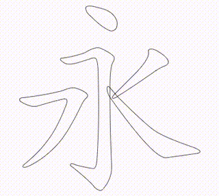

# Stroke order animator

This package implements stroke order animations and quizzes of Chinese characters based on
[Make me a Hanzi](https://github.com/skishore/makemeahanzi), available under the [ARPHIC public license](ARPHICPL.txt).

Try the [web version](https://chill-chinese.github.io/stroke-order-animator) or see it in action in the [Chill Chinese App](https://chill-chinese.com).

Read the [docs](https://pub.dev/documentation/stroke_order_animator/latest/stroke_order_animator/stroke_order_animator-library.html).

Check out the [example](example/lib/main.dart).

